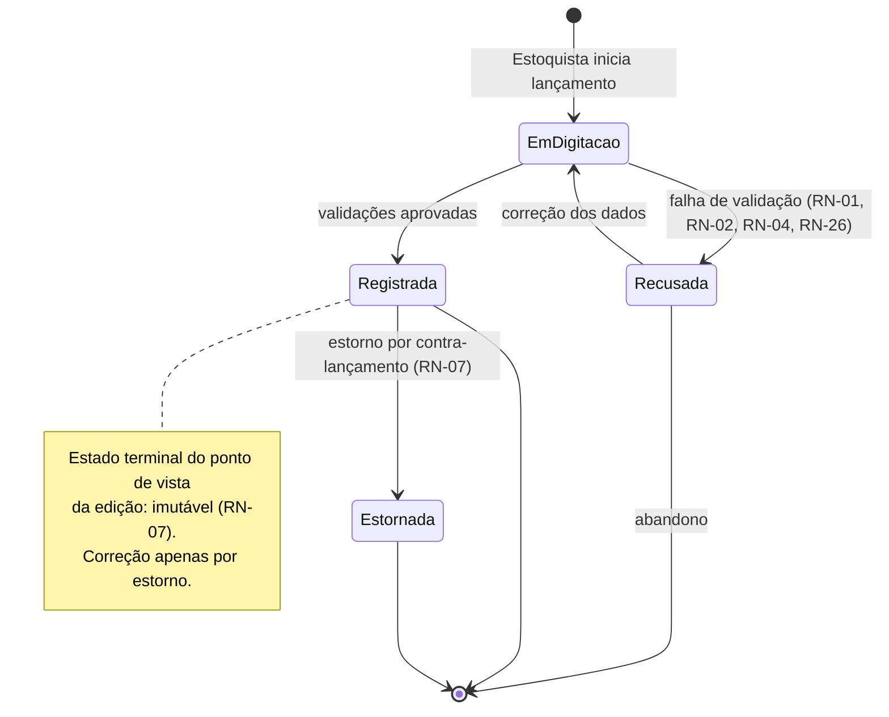
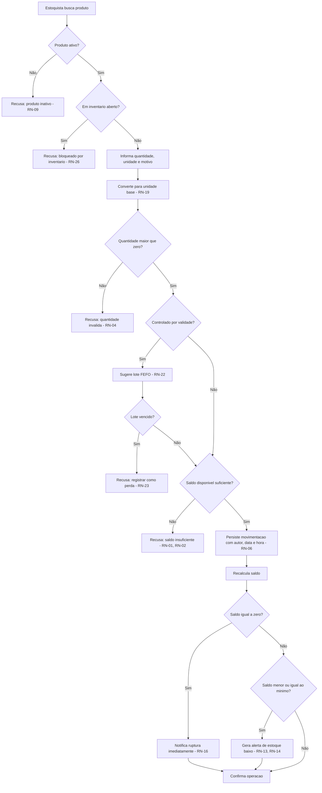
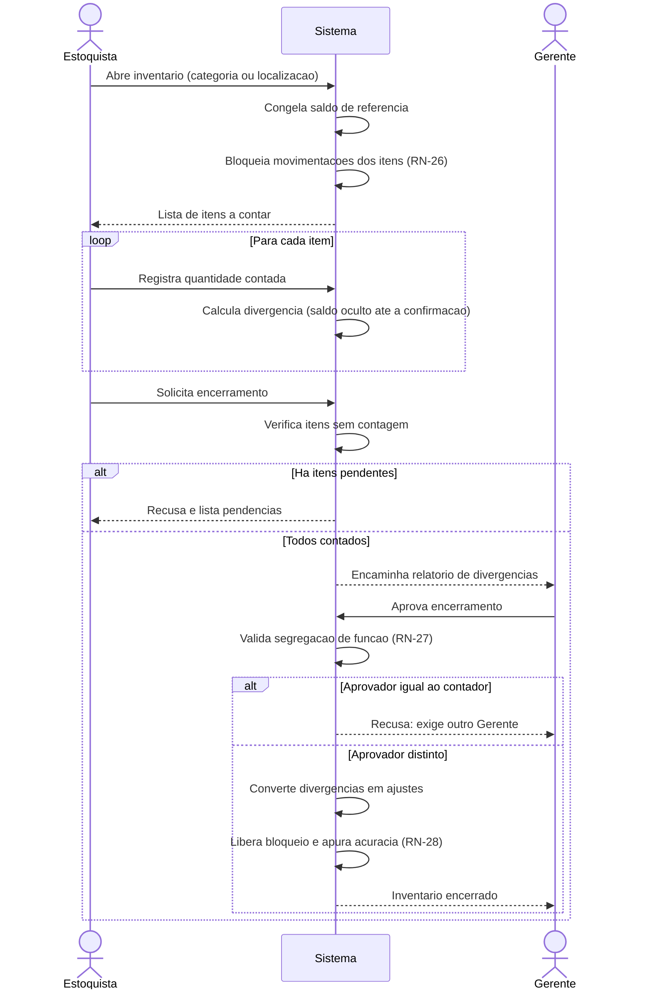
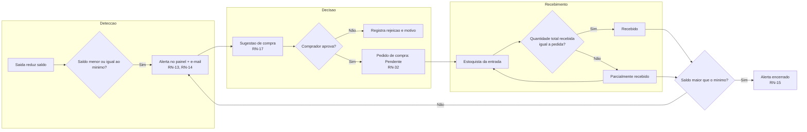
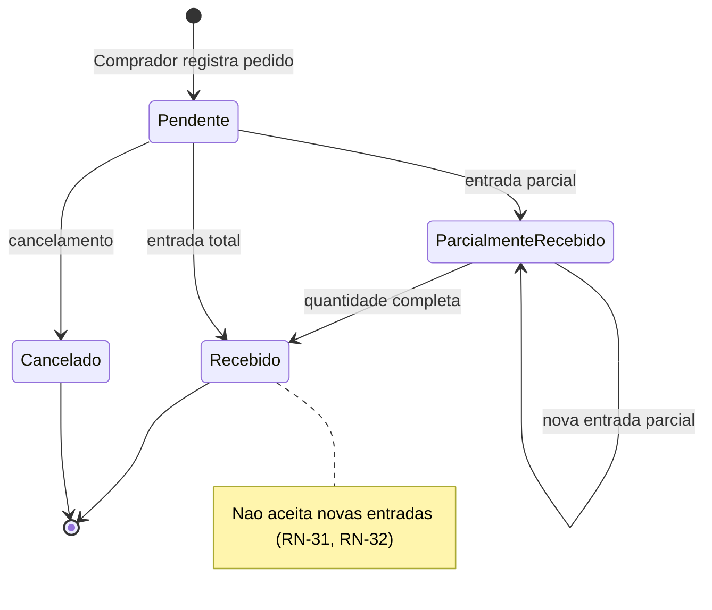
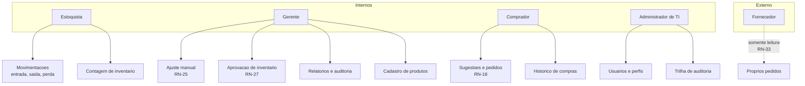

# Fluxos e Protótipos — Sistema de Controle de Estoque (StockPlus)

Representações visuais e esquemáticas dos fluxos especificados. Os diagramas usam sintaxe Mermaid,
renderizada nativamente pelo GitHub; os protótipos são de baixa fidelidade (*wireframes* textuais),
adequados a validação de conteúdo e fluxo, não de identidade visual.

---

## 1. Estados de uma movimentação

Registra a decisão de imutabilidade de RN-07: uma movimentação não retorna a estado editável.



---

## 2. Fluxo de registro de saída (UC-01)



> A leitura do diagrama evidencia algo que a lista de requisitos esconde: **cinco dos nove nós de
> decisão são recusas**. A operação mais frequente do sistema é dominada por validação, e não pelo
> caminho principal. Isso justifica tanto o detalhamento em caso de uso quanto a exigência de RNF-19 —
> cinco interações no máximo, apesar de toda essa checagem.

---

## 3. Fluxo de inventário físico (UC-02)



---

## 4. Ciclo de reposição (UC-03)



---

## 5. Estados do pedido de compra (RN-32)



---

## 6. Atores e perfis



---

## 7. Protótipos de baixa fidelidade

### 7.1 Painel de estoque (US-20)

```
+---------------------------------------------------------------------------+
| StockPlus                              Ana Ribeiro (Gerente)   [ Sair ]   |
+---------------------------------------------------------------------------+
| Painel | Produtos | Movimentacoes | Inventario | Compras | Relatorios     |
+---------------------------------------------------------------------------+
|                                                                           |
|  +------------------+  +------------------+  +------------------+          |
|  | Produtos ativos  |  | Estoque baixo    |  | Em ruptura       |          |
|  |      1.284       |  |       37   >     |  |        6   >     |          |
|  +------------------+  +------------------+  +------------------+          |
|                                                                           |
|  Ultimas movimentacoes                                                    |
|  +---------+--------------------+--------+-------+--------------+-------+  |
|  | Hora    | Produto            | Tipo   | Qtd   | Usuario      | Saldo |  |
|  +---------+--------------------+--------+-------+--------------+-------+  |
|  | 14:32   | Parafuso 8mm       | Saida  |   -30 | J. Martins   |   120 |  |
|  | 14:20   | Cabo de aco 5mm    | Entrada|  +200 | J. Martins   |   340 |  |
|  | 13:58   | Fita isolante      | Perda  |    -5 | C. Alves     |    42 |  |
|  | 11:07   | Disco de corte     | Ajuste |    +3 | A. Ribeiro   |    88 |  |
|  +---------+--------------------+--------+-------+--------------+-------+  |
|                                                    [ Ver historico ]      |
+---------------------------------------------------------------------------+
```

Decisões de projeto embutidas no protótipo:

- **Ruptura em bloco separado de estoque baixo.** Refletem regras distintas (RN-16 e RN-13) e exigem
  reações distintas: uma é urgência, a outra é planejamento.
- **Coluna "Usuário" na lista de movimentações.** Torna E-08 visível no primeiro contato com o
  sistema, e não escondida em uma tela de auditoria.
- **Coluna "Saldo" após cada lançamento.** Atende E-04 e serve de conferência imediata para quem
  acabou de lançar.

### 7.2 Registro de saída (US-07 / UC-01)

```
+---------------------------------------------------------------------------+
| Registrar saida                                                    [ X ]  |
+---------------------------------------------------------------------------+
|                                                                           |
|  Produto *  [ SKU-1001 - Parafuso sextavado 8mm            ] [ Buscar ]   |
|                                                                           |
|  +---------------------------------------------------------------------+  |
|  | Saldo fisico:     150 UN        Localizacao:  Rua B / Prat. 12      |  |
|  | Saldo disponivel: 150 UN        Estoque min.: 100 UN                |  |
|  +---------------------------------------------------------------------+  |
|                                                                           |
|  Quantidade *  [      30 ]   Unidade * [ UN  v ]  ( = 30 UN base )        |
|                                                                           |
|  Motivo *      [ Venda                                            v ]     |
|                                                                           |
|  Observacao    [                                                     ]    |
|                                                                           |
|  +---------------------------------------------------------------------+  |
|  | ! Apos esta saida o saldo sera 120 UN, acima do minimo (100 UN).    |  |
|  +---------------------------------------------------------------------+  |
|                                                                           |
|                                      [ Cancelar ]   [ Confirmar saida ]   |
+---------------------------------------------------------------------------+
```

Decisões de projeto embutidas:

- **Prévia do saldo resultante antes da confirmação.** Previne o erro mais comum da operação — lançar
  quantidade trocada — sem depender da mensagem de recusa de RN-02.
- **Conversão exibida ao lado da unidade** (`= 30 UN base`). Torna RN-19 verificável pelo operador em
  vez de opaca.
- **Contagem de interações.** Produto, quantidade, unidade, motivo e confirmar: exatamente 5,
  cumprindo RNF-19.
- **Ausência de campo "usuário".** Deliberada: o autor vem da sessão autenticada (RN-06, CA-24.5) e
  jamais é digitável.

### 7.3 Contagem de inventário (US-17 / UC-02)

```
+---------------------------------------------------------------------------+
| Inventario #2026-014  -  Categoria: Fixadores            Status: Aberto   |
+---------------------------------------------------------------------------+
|  Progresso: 12 de 40 itens contados        Contagem por: J. Martins       |
|                                                                           |
|  Item 13 de 40                                                            |
|  +---------------------------------------------------------------------+  |
|  |  SKU-1047  -  Arruela lisa 10mm                                     |  |
|  |  Localizacao: Rua B / Prateleira 04                                 |  |
|  |                                                                     |  |
|  |  Quantidade contada *  [          ]  UN                             |  |
|  |                                                                     |  |
|  |  ( O saldo do sistema sera exibido apos a confirmacao )             |  |
|  +---------------------------------------------------------------------+  |
|                                                                           |
|            [ Pular item ]   [ Confirmar e ir para o proximo ]             |
|                                                                           |
|  Itens ja contados                                                        |
|  +----------+-----------------------+---------+---------+-------------+   |
|  | SKU      | Produto               | Sistema | Contado | Divergencia |   |
|  +----------+-----------------------+---------+---------+-------------+   |
|  | SKU-1001 | Parafuso sextavado 8mm|     120 |     117 |         -3  |   |
|  | SKU-1012 | Parafuso Philips 6mm  |      88 |      88 |          0  |   |
|  +----------+-----------------------+---------+---------+-------------+   |
+---------------------------------------------------------------------------+
```

Decisão de projeto central: **o saldo do sistema aparece na tabela de itens já contados, nunca no
campo em digitação.** É a materialização do passo 4 de UC-02 e de CA-17.4. Um protótipo que exibisse
o saldo esperado ao lado do campo de digitação satisfaria todos os requisitos funcionais escritos e,
ainda assim, produziria inventários inúteis — razão pela qual essa restrição foi elevada a critério
de aceitação em vez de ficar como recomendação de interface.

### 7.4 Painel de alertas e sugestões (US-13 / US-16)

```
+---------------------------------------------------------------------------+
| Alertas de estoque                            Carlos Dias (Compras)       |
+---------------------------------------------------------------------------+
|  [ Todos ]  [ Em ruptura (6) ]  [ Estoque baixo (37) ]  [ Sem fornecedor ]|
|                                                                           |
|  +--------+-------------------+-------+-------+-------+-------+---------+  |
|  | Estado | Produto           | Saldo | Min.  | Trans.| Sugerir| Acao   |  |
|  +--------+-------------------+-------+-------+-------+-------+---------+  |
|  | RUPTURA| Disco de corte 7" |     0 |    50 |     0 |    60 | [Aprov]|  |
|  | RUPTURA| Fita isolante 20m |     0 |   120 |    80 |    40 | [Aprov]|  |
|  | Baixo  | Parafuso 8mm      |    98 |   100 |     0 |    24 | [Aprov]|  |
|  | Baixo  | Arruela lisa 10mm |    45 |    60 |    60 |     - | [ -- ] |  |
|  +--------+-------------------+-------+-------+-------+-------+---------+  |
|                                                                           |
|  Legenda: Trans. = quantidade em pedidos pendentes (RN-17)                 |
|           " - "  = sugestao nao gerada; pedidos em transito ja suprem      |
+---------------------------------------------------------------------------+
```

Decisões de projeto embutidas:

- **Coluna "Trans." explícita.** Sem ela, o comprador não entende por que um produto abaixo do mínimo
  não gerou sugestão, e tende a comprar em duplicidade — exatamente o desperdício que RN-17 evita.
- **Filtro "Sem fornecedor".** Expõe a exceção E3 de UC-03, que de outro modo se manifestaria como
  alerta silenciosamente sem sugestão.
- **Aprovação item a item, nunca em lote automático.** Materializa RN-18.

---

## 8. Limites destes protótipos

São artefatos de **baixa fidelidade**, destinados a validar conteúdo, sequência e regra de negócio
com os stakeholders. Não definem identidade visual, tipografia, espaçamento nem comportamento
responsivo. As decisões de acessibilidade de RNF-21 (contraste de 4.5:1, navegação por teclado,
rótulos associados) e de uso em tablet (RNF-23) precisam ser tratadas na etapa de design de
interface, que não é objeto desta especificação.
